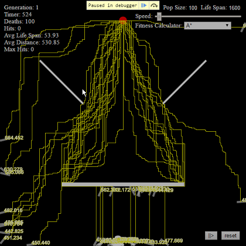
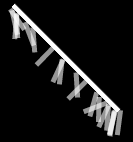

# Smart organisms
> A nano project aimed to learn more about the [p5.js](http://p5js.org) library and genetic algorithm.

Based on the work of Daniel Shiffman: http://codingtra.in

You can run it [here](https://rawgit.com/conradoqg/study-nano-projects/master/smart-organisms/index.html).

## Goals

The goal of this nano project was to understand how much I could to improve the smart rockets project from Daniel Shiffman. 

To achieve that I created the following list of improvements:
1. Make the canvas larger so it can be more interesting, especially when dealing with performance improvements;
2. Change the way it calculates the fitness of an organism. Later, this would prove to be a good idea because after some improvements it was possible to add more obstacles and keep the genetic algorithm reliable in finding more challenging paths.
3. Improve code organization and componentization;
4. See how far the genetic algorithm would go to make the organisms reach the target (hit rate);
5. Add more fitness calculation algorithms to see how the simulation responds to it;
6. Add historical statistics to visualize the evolution of the genetic algorithm;
7. Add controls to manage the environment (population size, speed, number of organisms, fitness algorithm chooser, play/pause and reset);
8. Create a plugin system;
9. Correctly calculate collisions of rotated objects. This would prove to be harder than I thought;
10. Add more obstacles!
11. Add more gene characteristics!

## Genetic algorithm
The genetic algorithm used in this project if very straight forward. A world containing a population, a population composed of organisms and each organism with its genes: movement, size and max force (max force in this case representing its agility).

At the end of each generation, every organism fitness is calculated using one of the three available methods:
1. A\*: A weighted calculation between life span and A* distance to target;
2. Weighted: A weighted calculation between life span and direct distance to target;
3. Direct distance: The direct distance between the organism and the target;

A\* weighted formula:
```javascript
// Weights
const distanceWeight = 10;
const lifeSpaneWeight = 5;

// Calculates fitness generating a number between the min and max
let distanceFitness = (100 - p5i.map(distance, minDistance, maxDistance, 0, 100));
let lifeSpanFitness = p5i.map(lifeSpan, minLifespan, maxLifespan, 0, 100);

// Apply weights to the calculated fitness
let result = (distanceFitness * distanceWeight) + (lifeSpanFitness * lifeSpaneWeight);

// Apply extra weight when the organism hits the goal
if (organism.completed) result *= 5;
```

where `distance` is the total A* path steps to target, `lifespan` is the highest world tick before death (or when it hits the target, the max possible lifespan).

A Mating pool is created to give a proportional number of DNA variance between the lower and top organisms. 

Mating pool:
```javascript
// Find max fitness
let maxFit = 0;
for (let i = 0; i < this.organisms.length; i++) {
    maxFit = Math.max(this.organisms[i].fitness, maxFit);
}

// Map fitness between 0 and 1.        
for (let i = 0; i < this.organisms.length; i++) {
    this.organisms[i].fitness /= maxFit;
}

// Adds the organisms N times to mating pool according to its fitness proportional value. Multiplies N by 100 to give a minimum of 1 option for the lowest ranked organism
this.matingPool = [];
for (let i = 0; i < this.organisms.length; i++) {
    let n = this.organisms[i].fitness * 100;
    for (let j = 0; j < n; j++) {
        this.matingPool.push(this.organisms[i]);
    }
}
```

With the pool created we need to randomly select organisms to mate and to crossover its DNAs.

Selection:
```javascript
// Randomly choose two partners from mating pool and mate them
let newOrganisms = [];
for (let i = 0; i < this.organisms.length; i++) {
    const parentA = p5i.random(this.matingPool);
    const parentB = p5i.random(this.matingPool);
    const child = parentA.mate(parentB);
    newOrganisms[i] = child;
}
this.organisms = newOrganisms;
```

And at the end, cross its DNAs with a 0.1% mutation. The mutation is necessary to create outliers that can push and give more survivorship to these organisms.

Crossover:
```javascript
crossover(partner) {
    const newDNA = new DNA(this.genes.movement.length);
    newDNA.genes.movement = this.crossoverMovement(partner);
    newDNA.genes.size = this.crossoverSize(partner);
    newDNA.genes.maxForce = this.crossoverMaxForce(partner);        
    return newDNA;
}

crossoverMovement(partner) {
    // Selects a random midpoint position and cross the dna genes from that midpoint
    let newMovementGenes = [];
    let mid = p5i.floor(p5i.random(this.genes.movement.length));
    for (let i = 0; i < this.genes.movement.length; i++) {
        // Set the gene from itself or form its partner depending on the midpoint.
        if (i > mid) {
            newMovementGenes[i] = this.genes.movement[i];
        } else {
            newMovementGenes[i] = partner.genes.movement[i];
        }

        // Mutate the gene which will bring diversity to the organism. 0.01 mutation chance
        if (p5i.random(1) < 0.01) {
            newMovementGenes[i] = this.createNewMovementGene();
        }
    }
    return newMovementGenes;
}

crossoverSize(partner) {
    let newSizeGene = {};

    // New size will be somewhere between this DNA size and its partner with 0.01 size mutation
    newSizeGene.width = p5i.random(this.genes.size.width, partner.genes.size.width) * p5i.random(0.99, 1.01);
    newSizeGene.height = p5i.random(this.genes.size.height, partner.genes.size.height) * p5i.random(0.99, 1.01);

    return newSizeGene;
}

crossoverMaxForce(partner) {
    // New max force will be somewhere between this DNA max force and its partner with 0.01 max force mutation
    let newMaxForce = p5i.random(this.genes.maxForce + partner.genes.maxForce) * p5i.random(0.99, 1.01);
    return newMaxForce;
}
```

## Performance bottlenecks

### A* pathfinding
The major performance issue I had was the A* algorithm. I'm using [this](https://github.com/bgrins/javascript-astar) lib, which is a nice implementation of the algorithm, however, my initial idea was to create a grid of 600x600 (the canvas size) and determine the walkable paths from its colors (black for passable paths and white for walls).
I found myself waiting between 10 and 15 seconds for the calculation of all 100 organism paths in order to give a fitness score to all organisms. This calculation must be done at the end of every generation.

To improve the total time needed I cached the created graph and every new path search I simply clean the graph. Unfortunately, that algorithm mixes the data with the function so it's not possible to shallow copy the graph and because of that, I need to reset and clear every node in that graph (600*600 = 360,000 nodes). There is still row for improvement here.

Even though the total time need was very large, between 7 and 11 seconds, I needed to improve it more. After a night or two wondering how it could be done I found two possible solutions: shrinking the canvas size or caching every possible combination of paths and their distances. I decided to start with the first one and that proved to be an acceptable solution.

The idea I had came from JPEG compression, it's not the same algorithm of course, but the idea is the same. Instead of calculating a path in a 600x600 canvas, I reduce that canvas size by X% and then calculate the distance between these two points in a smaller version of the canvas-map representation. The solution made the distance less accurate but it did in an even manner for all organisms, so no losses here.

This time, reducing the canvas size by 50% made the timing go from 7-11 seconds to < 1 seconds. After more caching and profiles to find slow parts it decreased to < 400ms in my machine.

Interesting results, I wonder how they do in games with paths larger than mine. Do they do the same?



### Functional programming
At the beginning, because I love working with functional programming and libs like [ramda](http://ramdajs.com/) everything was planned to be made with it.
After a while, I understood that one of my goals was performance, and I need to tell you, 1600 ticks and 60 FPS rate doesn't go together with functional programming. It seems that every bit of performance needs to be squeezed to make it fast enough. So it wasn't easy to abandon that idea. You can see basic fors everywhere.

An interesting thing I found is that using `var` in a `for` is better than the new `let`, because of reasons.

## Colissions

The canvas object and the p5 library provides ways to rotate objects but it does the rotation internally and because of that it's not possible to know the vectors of the rotated object (I didn't find a way) and therefore to use it to calculate the collision by its vertices.

To help me with that I found the formula to rotate vectors around an origin:
```
var newX = Math.cos(angle) * (this.x - origin.x) - Math.sin(angle) * (this.y - origin.y) + origin.x;
var newY = Math.sin(angle) * (this.x - origin.x) + Math.cos(angle) * (this.y - origin.y) + origin.y;
```

Because of this, instead of leveraging the rotation to canvas/p5 I do it by myself, improving the performance (because I can do only one time and use that for rendering and colission calculation).

The p5 doesn't have a collision system so I took advantage of [p5.collide2D](https://github.com/bmoren/p5.collide2D).

I'm happy with the results and because of that, I can check collision in angled rectangles.



## Development

    $ git clone git@github.com:conradoqg/study-nano-projects.git
    $ cd study-nano-projects/smart-organisms
    $ npm install

### Start task
It serves a realtime http that bundles the sources, do LiveReloading, and open the browser for you.
    
    $ npm start
    
### Dist task
It generates the bundled javascript and write it to dist/

    $ npm run dist